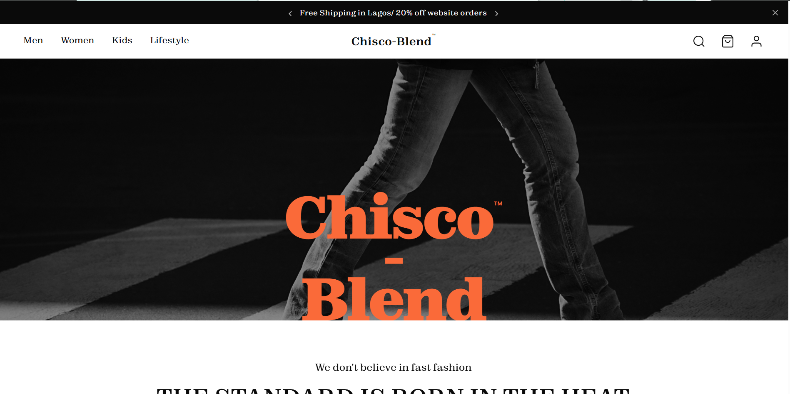
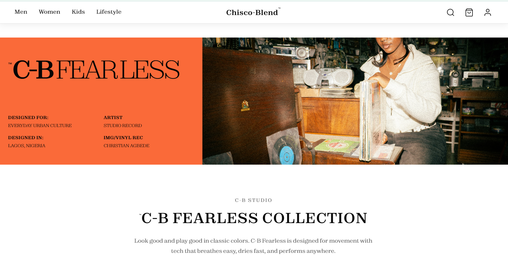
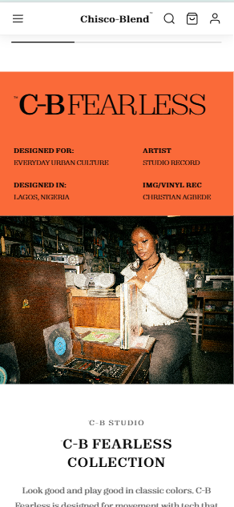

# Chisco-Blend™

> **Streetwear brand landing page — designed and built to read like a magazine and a storefront at once.**

**Live site:** [chisco-blend.vercel.app](https://chisco-blend.vercel.app)

---

## About

Chisco-Blend is a streetwear brand landing page — designed and built to read like a magazine and a storefront at once. Bold editorial typography, moody imagery, and a clean path to purchase.

The site is fully responsive, hand-coded in vanilla HTML, CSS, and JavaScript — no frameworks. Every component, from the hero treatment to the accordion footer to the discover carousel, is custom-built. I designed it in Figma, then coded it to match.

I'm a designer who builds. Chisco-Blend is part of an ongoing portfolio of work where I push my designs through to production — because I think the best designers understand both sides of the screen.

---

## Design decisions

### Editorial hero typography

The wordmark is stacked — **Chisco** on top, a hyphen anchoring the middle, **Blend** below — over a moody black-and-white photograph. The treatment borrows from editorial print: oversized serif type, deliberate negative space, and a single accent color doing all the visual lifting. The same treatment is echoed at the bottom of the page as a footer stamp, closing the page the way the hero opens it.

### Responsive fearless banner

The C-B Fearless banner is the same content reimagined for two screens. On desktop, it's a 40/60 split — bold type on orange, paired with editorial imagery on the right. On mobile, it stacks into a poster-style block with a tighter details grid below, so the hierarchy holds even at 390px wide.

**Desktop**

**Mobile**

---

## Tech stack

- HTML5
- CSS3 (custom properties, grid, flexbox, media queries)
- Vanilla JavaScript
- [Zodiak](https://www.fontshare.com/fonts/zodiak) by Fontshare (Light, Regular, Bold, Black)
- Hosted on [Vercel](https://vercel.com)

---

## Connect

- **Email:** emmanuelofilipc@gmail.com
- **GitHub:** [@uxbyemmanuel](https://github.com/uxbyemmanuel)
- **Instagram:** [@uxby.emmanuel](https://instagram.com/uxby.emmanuel)

---

**Designed and built by Emmanuel Ofili — Lagos, Nigeria.**
